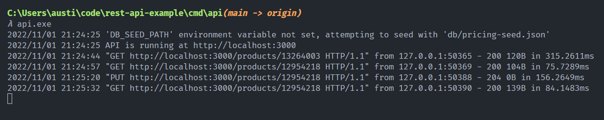

## Prerequisites
- [Golang 1.19+](https://go.dev/dl/)

## Setup
1. Clone the repository
2. Change directory into the `cmd/api` folder
```bash
cd rest-api-example\cmd\api\
```
3. Build the application with the `go build` command
4. Set the required `EXTERNAL_API_KEY` variable, see [Environment variables](#Environment-variables) section
5. Execute the resulting binary - `api.exe`

#### Windows example
```bash
# Clone the repo
git clone https://github.com/austinvalle/rest-api-example.git

# Change directory to the main API folder
cd rest-api-example\cmd\api\

# Build the API
go build .

# Set the EXTERNAL_API_KEY env variable
set EXTERNAL_API_KEY=api.key.goes.here

# Run the executable/binary, will seed by default with `cmd/api/db/pricing-seed.json`
api.exe
```

## Environment variables
- `EXTERNAL_API_KEY` - **required**
- `DB_SEED_PATH` - *optional*
    - Used to seed pricing data with a different JSON file/path, defaults to `db/pricing-seed.json`
- `API_PORT` - *optional*
    - Used to have API listen for HTTP requests on a specific port, defaults to `3000`


## Testing the API
There are two available API endpoints:
- `GET` http://localhost:3000/products/{id}
- `PUT` http://localhost:3000/products/{id}
    - **Request body example**
    ```json
    {
        "value": 20.34,
        "currency_code": "USD"
    }
    ```

## Example output
#### Client


#### Server

